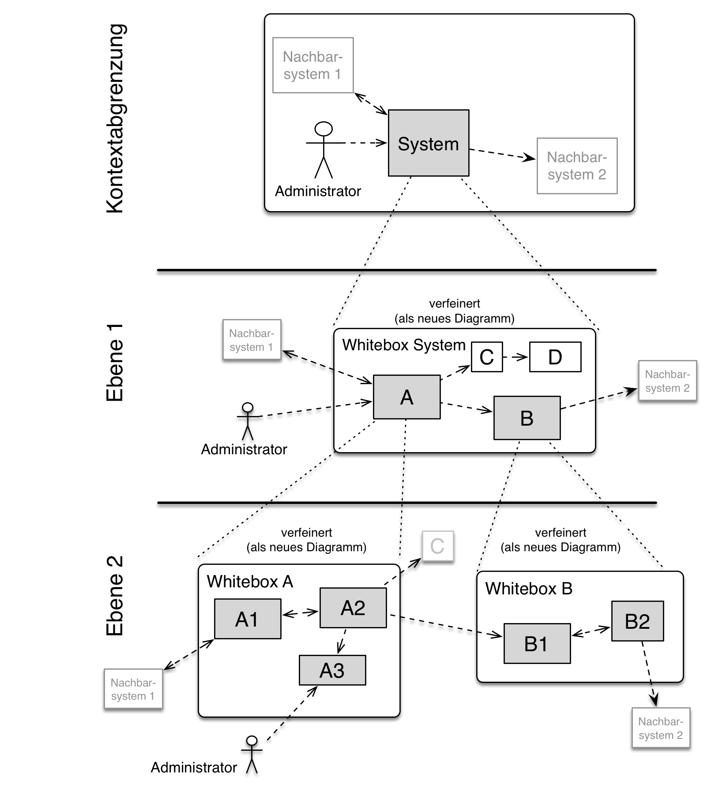

# SQS DEMO Projekt

# Einführung und Ziele

Das vorliegende Projekt ist ein Python-basiertes Webanwendung, 
die als Cache für Webanfragen an den OpenWeatherAPI-Service dient. 
Es nutzt das Flask-Framework und ist darauf ausgelegt, 
Qualitätssicherungsmaßnahmen zu demonstrieren.  

Die wesentlichen Anforderungen und treibenden Kräfte, die bei der 
Umsetzung der Softwarearchitektur und Entwicklung des Systems 
berücksichtigt werden, sind wie folgt:

- Zugrunde liegende Geschäftsziele: Das Hauptziel dieses Projekts 
ist es, die Effizienz von Webanfragen an den OpenWeatherAPI-Service zu verbessern, 
indem häufig angeforderte Daten zwischengespeichert werden. Dies reduziert die 
Latenzzeit und reduziert die Last und Kosten auf der genutzten API.

- Wesentliche Aufgabenstellungen: Das System muss in der Lage sein, Anfragen 
zu empfangen, die relevanten Daten aus dem Cache zu extrahieren (falls vorhanden) 
oder die Anfrage an den OpenWeatherAPI-Service weiterzuleiten, die Antwort zu speichern 
und an den Benutzer zurückzugeben.

- Wesentliche funktionale Anforderungen: Das System muss eine RESTful API 
bereitstellen, die es Benutzern ermöglicht, Wetterdaten für eine bestimmte Stadt abzurufen. Es muss auch in der Lage sein, die Daten effizient zu cachen und zu aktualisieren. 

- Qualitätsziele für die Architektur: Die Architektur des Systems muss 
robust, skalierbar und wartbar sein. Sie muss auch gut dokumentiert sein, 
um die Qualitätssicherung zu erleichtern.

- Relevante Stakeholder und deren Erwartungshaltung: Die relevanten Stakeholder 
für dieses Projekt sind der Entwickler, der API-Anbieter (OpenWeatherMap) und der Dozent. 
Die Entwickler und Dozent erwarten eine klare, gut strukturierte und gut 
dokumentierte Codebasis. Der API-Anbieter erwartet eine effiziente Abfrage von Daten.

## Aufgabenstellung

Kurzbeschreibung der fachlichen Aufgabenstellung, treibenden Kräfte,
Extrakt (oder Abstract) der Anforderungen. Verweis auf (hoffentlich
vorliegende) Anforderungsdokumente (mit Versionsbezeichnungen und
Ablageorten).

Das Ziel des Projektes ist es Qualitätssichernde Masnahmen für Python Projekte zu demonstrieren.
Dabei wird eine Beispielanwendung geschrieben, die als Cache für die OpenWeatherApi dient.
Diese wird mit einer einfachen Weboberfläche ergänzt.
Die Anwendung wird dabei mit verschiedenen Qualitätssichernden Maßnahmen gegen Fehler abgesichert.

# todo Beweggründe für neues System
# todo use case (Tabelle)

Kurze textuelle Beschreibung, eventuell in tabellarischer Use-Case Form.
Sofern vorhanden, sollte die Aufgabenstellung Verweise auf die
entsprechenden Anforderungsdokumente enthalten.

Halten Sie diese Auszüge so knapp wie möglich und wägen Sie Lesbarkeit
und Redundanzfreiheit gegeneinander ab.

Siehe [Anforderungen und Ziele](https://docs.arc42.org/section-1/) in
der online-Dokumentation (auf Englisch!).

## Qualitätsziele

# todo tabelle

Ziel Motivation

Sicherheit Wenn das System öffentlich zur Verfügung gestellt wird, können von schädlichen Aktören versuchen das System zu manipullieren. Dies zu unterbinden sollte zu den wichtigsten Zielen bei der Entwicklung eines neues Systems sein.

Wartbarkeit Um das System nicht nach kurzer Zeit wieder ersetzen zu müssen, ist eine gute Wartbarkeit wichtig. Weiterhin können Fehler, die den Einsatz des Systems behindern dadurch schneller behoben werden.

Zuverlässigkeit Das System sollte auch im Produktiveinsatz mit einem möglichst niedrigen Wartungsaufwand genutzt werden können, um die Kosten die es verursacht zu minimieren.

## Stakeholder

Überblick über die Stakeholder des Systems:

-   Entwickler, die die Software entwickeln und wartet, dabei übernimmt
    die Entwickler die Verantwortung für die Implementierung und
    Wartung des Systems, sowie die Qualitätssicherung der Software.

-   Dozent der das Projekt betreut und das Ergebnis bewertet.

-   Api-Anbieter (OpenWeatherMap), der die Wetterdaten bereitstellt.

| Rolle        | Kontakt        | Erwartungshaltung |
|--------------|----------------|-------------------|
| *\<Rolle-1>* | *\<Kontakt-1>* | *\<Erwartung-1>*  |
| *\<Rolle-2>* | *\<Kontakt-2>* | *\<Erwartung-2>*  |

# Randbedingungen

Deployment als Docker Image

Nutzung einer externen API als Datenquelle: Als Datenquelle muss ein externen Anbieter genutzt werden.

Auslagern des Datenspeichers auf eine externe Datenbank: Die Daten müssen auf einem Dienst, der auf einem seperaten Dienst läuft, gespeichert werden.

Nutzung von Github: Nutzung von Github als Git-Dienstleister, sowie Github Actions zur implementierung von Pipelines; Das Projekt muss öffentlich sein.

Einfache Tabellen der Randbedingungen mit Erläuterungen. Bei Bedarf
unterscheiden Sie technische, organisatorische und politische
Randbedingungen oder übergreifende Konventionen (beispielsweise
Programmier- oder Versionierungsrichtlinien, Dokumentations- oder
Namenskonvention).

# Kontextabgrenzung

# todo tabelle

Schnittstelle Ein/Ausgang Verantwortlicher  Technische UmsetzungBeschreibung

Die Kontextabgrenzung grenzt das System gegen alle Kommunikationspartner
(Nachbarsysteme und Benutzerrollen) ab. Sie legt damit die externen
Schnittstellen fest und zeigt damit auch die Verantwortlichkeit (scope)
Ihres Systems: Welche Verantwortung trägt das System und welche
Verantwortung übernehmen die Nachbarsysteme?

Differenzieren Sie fachlichen (Ein- und Ausgaben) und technischen
Kontext (Kanäle, Protokolle, Hardware), falls nötig.

## Fachlicher Kontext

Festlegung **aller** Kommunikationsbeziehungen (Nutzer, IT-Systeme, …)
mit Erklärung der fachlichen Ein- und Ausgabedaten oder Schnittstellen.
Zusätzlich (bei Bedarf) fachliche Datenformate oder Protokolle der
Kommunikation mit den Nachbarsystemen.

Alle Beteiligten müssen verstehen, welche fachlichen Informationen mit
der Umwelt ausgetauscht werden.

Alle Diagrammarten, die das System als Blackbox darstellen und die
fachlichen Schnittstellen zu den Nachbarsystemen beschreiben.

Alternativ oder ergänzend können Sie eine Tabelle verwenden. Der Titel
gibt den Namen Ihres Systems wieder; die drei Spalten sind:
Kommunikationsbeziehung, Eingabe, Ausgabe.

## Technischer Kontext

# todo

Technische Schnittstellen (Kanäle, Übertragungsmedien) zwischen dem
System und seiner Umwelt. Zusätzlich eine Erklärung (*mapping*), welche
fachlichen Ein- und Ausgaben über welche technischen Kanäle fließen.

Viele Stakeholder treffen Architekturentscheidungen auf Basis der
technischen Schnittstellen des Systems zu seinem Kontext.

Insbesondere bei der Entwicklung von Infrastruktur oder Hardware sind
diese technischen Schnittstellen durchaus entscheidend.

Beispielsweise UML Deployment-Diagramme mit den Kanälen zu
Nachbarsystemen, begleitet von einer Tabelle, die Kanäle auf
Ein-/Ausgaben abbildet.

**\<Diagramm oder Tabelle>**

**\<optional: Erläuterung der externen technischen Schnittstellen>**

**\<Mapping fachliche auf technische Schnittstellen>**

# Lösungsstrategie

-   Technologieentscheidungen

-   Entscheidungen über die Top-Level-Zerlegung des Systems,
    beispielsweise die Verwendung gesamthaft prägender Entwurfs- oder
    Architekturmuster,

-   Entscheidungen zur Erreichung der wichtigsten Qualitätsanforderungen
    sowie

-   relevante organisatorische Entscheidungen, beispielsweise für
    bestimmte Entwicklungsprozesse oder Delegation bestimmter Aufgaben
    an andere Stakeholder.

Diese wichtigen Entscheidungen bilden wesentliche „Eckpfeiler“ der
Architektur. Von ihnen hängen viele weitere Entscheidungen oder
Implementierungsregeln ab.

Fassen Sie die zentralen Entwurfsentscheidungen **kurz** zusammen.
Motivieren Sie, ausgehend von Aufgabenstellung, Qualitätszielen und
Randbedingungen, was Sie entschieden haben und warum Sie so entschieden
haben. Vermeiden Sie redundante Beschreibungen und verweisen Sie eher
auf weitere Ausführungen in Folgeabschnitten.

Siehe [Lösungsstrategie](https://docs.arc42.org/section-4/) in der
online-Dokumentation (auf Englisch!).

# Bausteinsicht

Die Bausteinsicht zeigt die statische Zerlegung des Systems in Bausteine
(Module, Komponenten, Subsysteme, Klassen, Schnittstellen, Pakete,
Bibliotheken, Frameworks, Schichten, Partitionen, Tiers, Funktionen,
Makros, Operationen, Datenstrukturen, …) sowie deren Abhängigkeiten
(Beziehungen, Assoziationen, …)

Diese Sicht sollte in jeder Architekturdokumentation vorhanden sein. In
der Analogie zum Hausbau bildet die Bausteinsicht den *Grundrissplan*.

Behalten Sie den Überblick über den Quellcode, indem Sie die statische
Struktur des Systems durch Abstraktion verständlich machen.

Damit ermöglichen Sie Kommunikation auf abstrakterer Ebene, ohne zu
viele Implementierungsdetails offenlegen zu müssen.

Die Bausteinsicht ist eine hierarchische Sammlung von Blackboxen und
Whiteboxen (siehe Abbildung unten) und deren Beschreibungen.

**Ebene 1** ist die Whitebox-Beschreibung des Gesamtsystems, zusammen
mit Blackbox-Beschreibungen der darin enthaltenen Bausteine.

**Ebene 2** zoomt in einige Bausteine der Ebene 1 hinein. Sie enthält
somit die Whitebox-Beschreibungen ausgewählter Bausteine der Ebene 1,
jeweils zusammen mit Blackbox-Beschreibungen darin enthaltener
Bausteine.

**Ebene 3** zoomt in einige Bausteine der Ebene 2 hinein, usw.

Siehe [Bausteinsicht](https://docs.arc42.org/section-5/) in der
online-Dokumentation (auf Englisch!).

## Whitebox Gesamtsystem

An dieser Stelle beschreiben Sie die Zerlegung des Gesamtsystems anhand
des nachfolgenden Whitebox-Templates. Dieses enthält:

-   Ein Übersichtsdiagramm

-   die Begründung dieser Zerlegung

-   Blackbox-Beschreibungen der hier enthaltenen Bausteine. Dafür haben
    Sie verschiedene Optionen:

    -   in *einer* Tabelle, gibt einen kurzen und pragmatischen
        Überblick über die enthaltenen Bausteine sowie deren
        Schnittstellen.

    -   als Liste von Blackbox-Beschreibungen der Bausteine, gemäß dem
        Blackbox-Template (siehe unten). Diese Liste können Sie, je nach
        Werkzeug, etwa in Form von Unterkapiteln (Text), Unter-Seiten
        (Wiki) oder geschachtelten Elementen (Modellierungswerkzeug)
        darstellen.

-   (optional:) wichtige Schnittstellen, die nicht bereits im
    Blackbox-Template eines der Bausteine erläutert werden, aber für das
    Verständnis der Whitebox von zentraler Bedeutung sind. Aufgrund der
    vielfältigen Möglichkeiten oder Ausprägungen von Schnittstellen
    geben wir hierzu kein weiteres Template vor. Im schlimmsten Fall
    müssen Sie Syntax, Semantik, Protokolle, Fehlerverhalten,
    Restriktionen, Versionen, Qualitätseigenschaften, notwendige
    Kompatibilitäten und vieles mehr spezifizieren oder beschreiben. Im
    besten Fall kommen Sie mit Beispielen oder einfachen Signaturen
    zurecht.

***\<Übersichtsdiagramm>***

Begründung  
*\<Erläuternder Text>*

Enthaltene Bausteine  
*\<Beschreibung der enthaltenen Bausteine (Blackboxen)>*

Wichtige Schnittstellen  
*\<Beschreibung wichtiger Schnittstellen>*

Hier folgen jetzt Erläuterungen zu Blackboxen der Ebene 1.

Falls Sie die tabellarische Beschreibung wählen, so werden Blackboxen
darin nur mit Name und Verantwortung nach folgendem Muster beschrieben:

| **Name**        | **Verantwortung** |
|-----------------|-------------------|
| *\<Blackbox 1>* |  *\<Text>*        |
| *\<Blackbox 2>* |  *\<Text>*        |

Falls Sie die ausführliche Liste von Blackbox-Beschreibungen wählen,
beschreiben Sie jede wichtige Blackbox in einem eigenen
Blackbox-Template. Dessen Überschrift ist jeweils der Namen dieser
Blackbox.

### \<Name Blackbox 1>

Beschreiben Sie die \<Blackbox 1> anhand des folgenden
Blackbox-Templates:

-   Zweck/Verantwortung

-   Schnittstelle(n), sofern diese nicht als eigenständige
    Beschreibungen herausgezogen sind. Hierzu gehören eventuell auch
    Qualitäts- und Leistungsmerkmale dieser Schnittstelle.

-   (Optional) Qualitäts-/Leistungsmerkmale der Blackbox, beispielsweise
    Verfügbarkeit, Laufzeitverhalten o. Ä.

-   (Optional) Ablageort/Datei(en)

-   (Optional) Erfüllte Anforderungen, falls Sie Traceability zu
    Anforderungen benötigen.

-   (Optional) Offene Punkte/Probleme/Risiken

*\<Zweck/Verantwortung>*

*\<Schnittstelle(n)>*

*\<(Optional) Qualitäts-/Leistungsmerkmale>*

*\<(Optional) Ablageort/Datei(en)>*

*\<(Optional) Erfüllte Anforderungen>*

*\<(optional) Offene Punkte/Probleme/Risiken>*

### \<Name Blackbox 2>

*\<Blackbox-Template>*

### \<Name Blackbox n>

*\<Blackbox-Template>*

### \<Name Schnittstelle 1>

…

### \<Name Schnittstelle m>

## Ebene 2

Beschreiben Sie den inneren Aufbau (einiger) Bausteine aus Ebene 1 als
Whitebox.

Welche Bausteine Ihres Systems Sie hier beschreiben, müssen Sie selbst
entscheiden. Bitte stellen Sie dabei Relevanz vor Vollständigkeit.
Skizzieren Sie wichtige, überraschende, riskante, komplexe oder
besonders volatile Bausteine. Normale, einfache oder standardisierte
Teile sollten Sie weglassen.

### Whitebox *\<Baustein 1>*

…zeigt das Innenleben von *Baustein 1*.

*\<Whitebox-Template>*

### Whitebox *\<Baustein 2>*

*\<Whitebox-Template>*

…

### Whitebox *\<Baustein m>*

*\<Whitebox-Template>*

## Ebene 3

Beschreiben Sie den inneren Aufbau (einiger) Bausteine aus Ebene 2 als
Whitebox.

Bei tieferen Gliederungen der Architektur kopieren Sie diesen Teil von
arc42 für die weiteren Ebenen.

### Whitebox \<\_Baustein x.1\_\>

…zeigt das Innenleben von *Baustein x.1*.

*\<Whitebox-Template>*

### Whitebox \<\_Baustein x.2\_\>

*\<Whitebox-Template>*

### Whitebox \<\_Baustein y.1\_\>

*\<Whitebox-Template>*

# Laufzeitsicht

**Inhalt**

Diese Sicht erklärt konkrete Abläufe und Beziehungen zwischen Bausteinen
in Form von Szenarien aus den folgenden Bereichen:

-   Wichtige Abläufe oder *Features*: Wie führen die Bausteine der
    Architektur die wichtigsten Abläufe durch?

-   Interaktionen an kritischen externen Schnittstellen: Wie arbeiten
    Bausteine mit Nutzern und Nachbarsystemen zusammen?

-   Betrieb und Administration: Inbetriebnahme, Start, Stop.

-   Fehler- und Ausnahmeszenarien

Anmerkung: Das Kriterium für die Auswahl der möglichen Szenarien (d.h.
Abläufe) des Systems ist deren Architekturrelevanz. Es geht nicht darum,
möglichst viele Abläufe darzustellen, sondern eine angemessene Auswahl
zu dokumentieren.

**Motivation**

Sie sollten verstehen, wie (Instanzen von) Bausteine(n) Ihres Systems
ihre jeweiligen Aufgaben erfüllen und zur Laufzeit miteinander
kommunizieren.

Nutzen Sie diese Szenarien in der Dokumentation hauptsächlich für eine
verständlichere Kommunikation mit denjenigen Stakeholdern, die die
statischen Modelle (z.B. Bausteinsicht, Verteilungssicht) weniger
verständlich finden.

**Form**

Für die Beschreibung von Szenarien gibt es zahlreiche
Ausdrucksmöglichkeiten. Nutzen Sie beispielsweise:

-   Nummerierte Schrittfolgen oder Aufzählungen in Umgangssprache

-   Aktivitäts- oder Flussdiagramme

-   Sequenzdiagramme

-   BPMN (Geschäftsprozessmodell und -notation) oder EPKs
    (Ereignis-Prozessketten)

-   Zustandsautomaten

-   …

Siehe [Laufzeitsicht](https://docs.arc42.org/section-6/) in der
online-Dokumentation (auf Englisch!).

## *\<Bezeichnung Laufzeitszenario 1>*

-   \<hier Laufzeitdiagramm oder Ablaufbeschreibung einfügen>

-   \<hier Besonderheiten bei dem Zusammenspiel der Bausteine in diesem
    Szenario erläutern>

## *\<Bezeichnung Laufzeitszenario 2>*

…

## *\<Bezeichnung Laufzeitszenario n>*

…

# Verteilungssicht

**Inhalt**

Die Verteilungssicht beschreibt:

1.  die technische Infrastruktur, auf der Ihr System ausgeführt wird,
    mit Infrastrukturelementen wie Standorten, Umgebungen, Rechnern,
    Prozessoren, Kanälen und Netztopologien sowie sonstigen
    Bestandteilen, und

2.  die Abbildung von (Software-)Bausteinen auf diese Infrastruktur.

Häufig laufen Systeme in unterschiedlichen Umgebungen, beispielsweise
Entwicklung-/Test- oder Produktionsumgebungen. In solchen Fällen sollten
Sie alle relevanten Umgebungen aufzeigen.

Nutzen Sie die Verteilungssicht insbesondere dann, wenn Ihre Software
auf mehr als einem Rechner, Prozessor, Server oder Container abläuft
oder Sie Ihre Hardware sogar selbst konstruieren.

Aus Softwaresicht genügt es, auf die Aspekte zu achten, die für die
Softwareverteilung relevant sind. Insbesondere bei der
Hardwareentwicklung kann es notwendig sein, die Infrastruktur mit
beliebigen Details zu beschreiben.

**Motivation**

Software läuft nicht ohne Infrastruktur. Diese zugrundeliegende
Infrastruktur beeinflusst Ihr System und/oder querschnittliche
Lösungskonzepte, daher müssen Sie diese Infrastruktur kennen.

**Form**

Das oberste Verteilungsdiagramm könnte bereits in Ihrem technischen
Kontext enthalten sein, mit Ihrer Infrastruktur als EINE Blackbox. Jetzt
zoomen Sie in diese Infrastruktur mit weiteren Verteilungsdiagrammen
hinein:

-   Die UML stellt mit Verteilungsdiagrammen (Deployment diagrams) eine
    Diagrammart zur Verfügung, um diese Sicht auszudrücken. Nutzen Sie
    diese, evtl. auch geschachtelt, wenn Ihre Verteilungsstruktur es
    verlangt.

-   Falls Ihre Infrastruktur-Stakeholder andere Diagrammarten
    bevorzugen, die beispielsweise Prozessoren und Kanäle zeigen, sind
    diese hier ebenfalls einsetzbar.

Siehe [Verteilungssicht](https://docs.arc42.org/section-7/) in der
online-Dokumentation (auf Englisch!).

## Infrastruktur Ebene 1

An dieser Stelle beschreiben Sie (als Kombination von Diagrammen mit
Tabellen oder Texten):

-   die Verteilung des Gesamtsystems auf mehrere Standorte, Umgebungen,
    Rechner, Prozessoren o. Ä., sowie die physischen Verbindungskanäle
    zwischen diesen,

-   wichtige Begründungen für diese Verteilungsstruktur,

-   Qualitäts- und/oder Leistungsmerkmale dieser Infrastruktur,

-   Zuordnung von Softwareartefakten zu Bestandteilen der Infrastruktur

Für mehrere Umgebungen oder alternative Deployments kopieren Sie diesen
Teil von arc42 für alle wichtigen Umgebungen/Varianten.

***\<Übersichtsdiagramm>***

Begründung  
*\<Erläuternder Text>*

Qualitäts- und/oder Leistungsmerkmale  
*\<Erläuternder Text>*

Zuordnung von Bausteinen zu Infrastruktur  
*\<Beschreibung der Zuordnung>*

## Infrastruktur Ebene 2

An dieser Stelle können Sie den inneren Aufbau (einiger)
Infrastrukturelemente aus Ebene 1 beschreiben.

Für jedes Infrastrukturelement kopieren Sie die Struktur aus Ebene 1.

### *\<Infrastrukturelement 1>*

*\<Diagramm + Erläuterungen>*

### *\<Infrastrukturelement 2>*

*\<Diagramm + Erläuterungen>*

…

### *\<Infrastrukturelement n>*

*\<Diagramm + Erläuterungen>*

# Querschnittliche Konzepte

## Fachliche Konzepte

{::comment}
TODO Namen/Definitionen für Begriffe
{:/comment}

## User Experience (UX)

### Ergonimie

### User Interface

## Sicherheitskonzepte (Safety und Security)

### Security

### Safety

## Architektur- und Entwurfsmuster

### Abstrahierung
Wrapper

### Cache Aside

### Model-View-Controller

### Time-To-live

## Anwendungsintere Konzepte

### Persistenz

### Exception Handling

## Entwicklungskonzepte

### Versionkontrolle

### Automatisierung

### Testen

### Bauen

## Betriebskonzepte

### Cache Strategie

### Modularisierung

### Auslieferung

# Architekturentscheidungen

1. Verwendung von Flask als Web-Framework für die Entwicklung der Webanwendung.
2. Integration einer externen API in die Webanwendung, um Daten abzurufen.
3. Implementierung eines Caches für die externe API, um die Performance zu verbessern.
4. Verwendung von PostgreSQL als Datenbank für die persistente Speicherung von Daten.
5. Nutzung von SQLAlchemy als ORM (Object-Relational Mapping) für die Datenbankinteraktion.
6. Verwendung von RESTful API-Designprinzipien für die Kommunikation zwischen der Webanwendung und der externen API.
7. Implementierung von Sicherheitsmaßnahmen wie Authentifizierung und Autorisierung für den Zugriff auf die Webanwendung und die externe API.
8. Einsatz von Logging und Fehlerbehandlung, um Probleme in der Webanwendung zu identifizieren und zu beheben.
9. Verwendung von Unit-Tests und Integrationstests, um die Funktionalität der Webanwendung zu überprüfen.
10. Bereitstellung der Webanwendung auf einer skalierbaren Infrastruktur wie z.B. AWS Elastic Beanstalk oder Kubernetes.
11. Implementierung von Monitoring und Logging für die Überwachung der Webanwendung und der externen API.
12. Verwendung von Continuous Integration und Continuous Deployment (CI/CD) für eine automatisierte Bereitstellung und Aktualisierung der Webanwendung.
13. Einrichtung von Backups und Wiederherstellungsmechanismen für die PostgreSQL-Datenbank, um Datenverlust zu vermeiden.
14. Implementierung von Caching-Strategien für häufig abgerufene Daten in der PostgreSQL-Datenbank, um die Performance zu verbessern.
15. Verwendung von Docker zur Containerisierung der Webanwendung und ihrer Abhängigkeiten für eine einfache Bereitstellung und Portabilität.
16. Einsatz von Load-Balancing und Skalierungstechniken, um die Webanwendung bei hoher Last zu skalieren und die Verfügbarkeit zu gewährleisten.
17. Verwendung von Git zur Versionskontrolle des Quellcodes der Webanwendung und der Konfigurationsdateien.
18. Implementierung von automatisierten Tests für die Webanwendung, um die Qualität und Stabilität des Codes sicherzustellen.
19. Verwendung von Code-Reviews und Peer-Feedback, um die Codequalität und Best Practices in der Entwicklung zu fördern.
20. Einrichtung von Monitoring und Alarmierung für die Überwachung der Systemleistung und das Erkennen von Problemen in Echtzeit.

Verschiedene Möglichkeiten:

-   ADR ([Documenting Architecture
    Decisions](https://cognitect.com/blog/2011/11/15/documenting-architecture-decisions))
    für jede wichtige Entscheidung

-   Liste oder Tabelle, nach Wichtigkeit und Tragweite der
    Entscheidungen geordnet

-   ausführlicher in Form einzelner Unterkapitel je Entscheidung

Siehe [Architekturentscheidungen](https://docs.arc42.org/section-9/) 

# Qualitätsanforderungen

**Inhalt**

Dieser Abschnitt enthält möglichst alle Qualitätsanforderungen als
Qualitätsbaum mit Szenarien. Die wichtigsten davon haben Sie bereits in
Abschnitt 1.2 (Qualitätsziele) hervorgehoben.

Nehmen Sie hier auch Qualitätsanforderungen geringerer Priorität auf,
deren Nichteinhaltung oder -erreichung geringe Risiken birgt.

**Motivation**

Weil Qualitätsanforderungen die Architekturentscheidungen oft maßgeblich
beeinflussen, sollten Sie die für Ihre Stakeholder relevanten
Qualitätsanforderungen kennen, möglichst konkret und operationalisiert.

**Weiterführende Informationen**

Siehe [Qualitätsanforderungen](https://docs.arc42.org/section-10/) in
der online-Dokumentation (auf Englisch!).

## Qualitätsbaum

**Inhalt**

Der Qualitätsbaum (à la ATAM) mit Qualitätsszenarien an den Blättern.

**Motivation**

Die mit Prioritäten versehene Baumstruktur gibt Überblick über
die — oftmals zahlreichen — Qualitätsanforderungen.

-   Baumartige Verfeinerung des Begriffes „Qualität“, mit „Qualität“
    oder „Nützlichkeit“ als Wurzel.

-   Mindmap mit Qualitätsoberbegriffen als Hauptzweige

In jedem Fall sollten Sie hier Verweise auf die Qualitätsszenarien des
folgenden Abschnittes aufnehmen.

## Qualitätsszenarien

**Inhalt**

Konkretisierung der (in der Praxis oftmals vagen oder impliziten)
Qualitätsanforderungen durch (Qualitäts-)Szenarien.

Diese Szenarien beschreiben, was beim Eintreffen eines Stimulus auf ein
System in bestimmten Situationen geschieht.

Wesentlich sind zwei Arten von Szenarien:

-   Nutzungsszenarien (auch bekannt als Anwendungs- oder
    Anwendungsfallszenarien) beschreiben, wie das System zur Laufzeit
    auf einen bestimmten Auslöser reagieren soll. Hierunter fallen auch
    Szenarien zur Beschreibung von Effizienz oder Performance. Beispiel:
    Das System beantwortet eine Benutzeranfrage innerhalb einer Sekunde.

-   Änderungsszenarien beschreiben eine Modifikation des Systems oder
    seiner unmittelbaren Umgebung. Beispiel: Eine zusätzliche
    Funktionalität wird implementiert oder die Anforderung an ein
    Qualitätsmerkmal ändert sich.

**Motivation**

Szenarien operationalisieren Qualitätsanforderungen und machen deren
Erfüllung mess- oder entscheidbar.

Insbesondere wenn Sie die Qualität Ihrer Architektur mit Methoden wie
ATAM überprüfen wollen, bedürfen die in Abschnitt 1.2 genannten
Qualitätsziele einer weiteren Präzisierung bis auf die Ebene von
diskutierbaren und nachprüfbaren Szenarien.

**Form**

Entweder tabellarisch oder als Freitext.

# Risiken und technische Schulden

- Mangelnde Fehlerbehandlung: Die Fehlerbehandlung in der Webanwendung ist unzureichend. Es sollten Mechanismen implementiert werden, um Fehler zu erkennen, zu protokollieren und angemessen zu behandeln.
- Fehlende Internationalisierung: Die Webanwendung unterstützt derzeit nur eine Sprache. Es sollte eine Internationalisierungsfunktion implementiert werden, um die Anwendung für verschiedene Sprachen und Regionen zugänglich zu machen.
- Mangelnde Skalierbarkeit: Die aktuelle Infrastruktur ist möglicherweise nicht ausreichend skalierbar, um mit steigender Last umzugehen. Es sollte eine Überprüfung und mögliche Anpassung der Infrastruktur vorgenommen werden.

Eine nach Prioritäten geordnete Liste der erkannten Architekturrisiken
und/oder technischen Schulden.

Unter diesem Motto sollten Sie Architekturrisiken und/oder technische
Schulden gezielt ermitteln, bewerten und Ihren Management-Stakeholdern
(z.B. Projektleitung, Product-Owner) transparent machen.

Liste oder Tabelle von Risiken und/oder technischen Schulden, eventuell
mit vorgeschlagenen Maßnahmen zur Risikovermeidung, Risikominimierung
oder dem Abbau der technischen Schulden.

# Glossar

**Inhalt**

Die wesentlichen fachlichen und technischen Begriffe, die Stakeholder im
Zusammenhang mit dem System verwenden.

Nutzen Sie das Glossar ebenfalls als Übersetzungsreferenz, falls Sie in
mehrsprachigen Teams arbeiten.

**Motivation**

Sie sollten relevante Begriffe klar definieren, so dass alle Beteiligten

-   diese Begriffe identisch verstehen, und

-   vermeiden, mehrere Begriffe für die gleiche Sache zu haben.

Zweispaltige Tabelle mit \<Begriff> und \<Definition>.

Eventuell weitere Spalten mit Übersetzungen, falls notwendig.

Siehe [Glossar](https://docs.arc42.org/section-12/) in der
online-Dokumentation (auf Englisch!).

| Begriff        | Definition        |
|----------------|-------------------|
| *\<Begriff-1>* | *\<Definition-1>* |
| *\<Begriff-2*  | *\<Definition-2>* |
